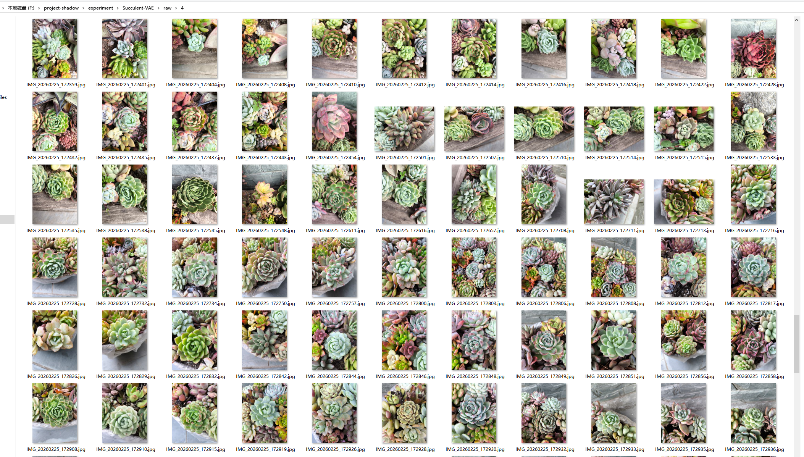
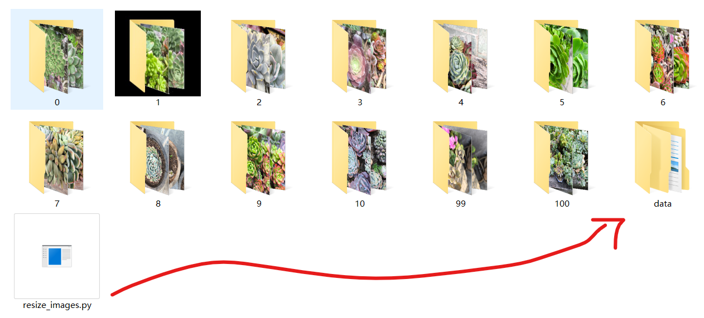
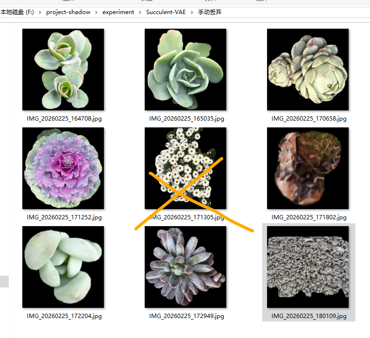
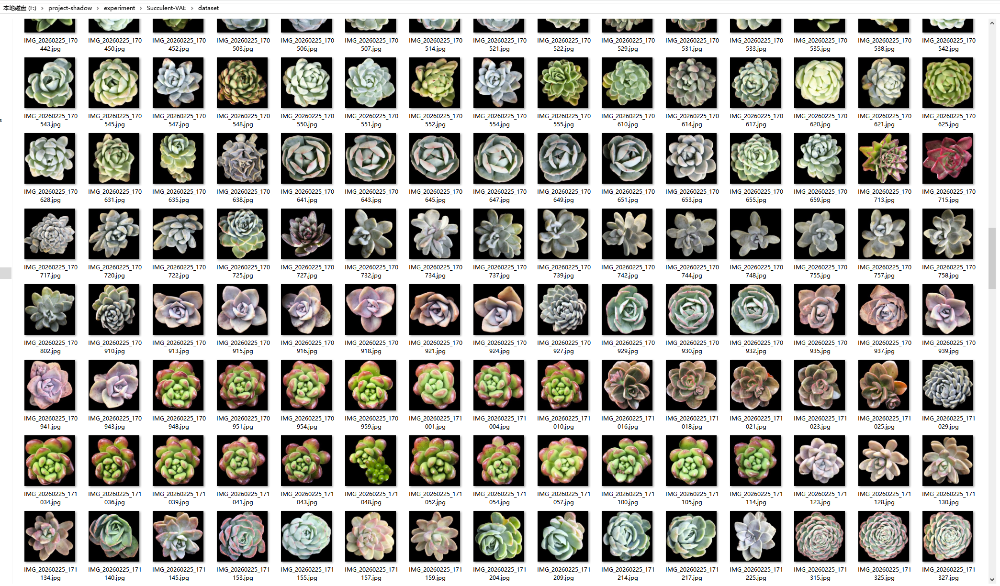
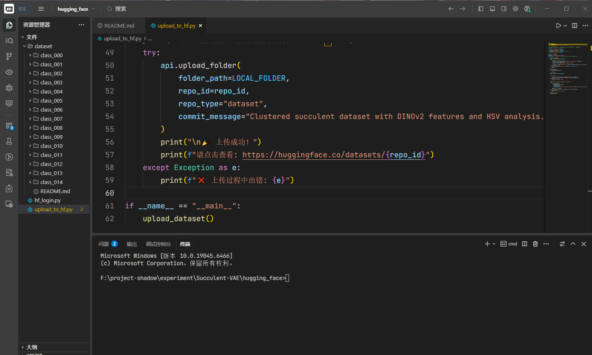
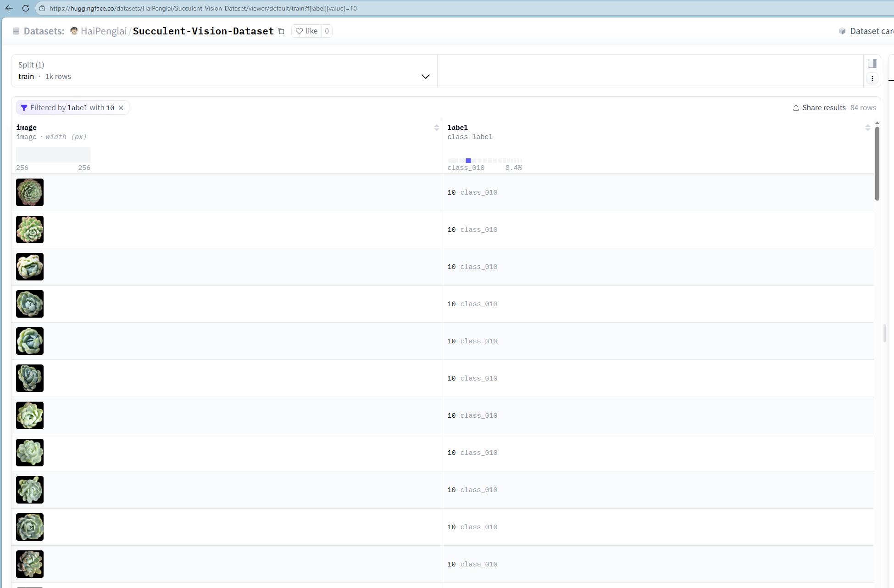
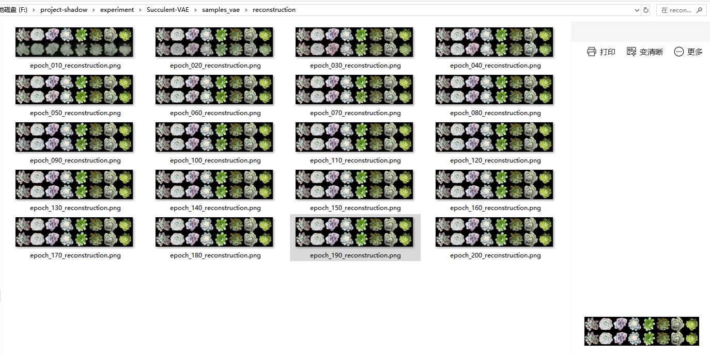
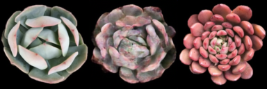
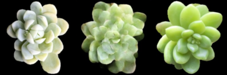
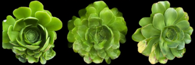

### 拍摄照片

在多肉植物园当中有很多的多肉，不过他们是一团一团长在一起的，所以拍照的时候要对着一朵拍，确保相机的中心是这朵多肉。其他的多肉也会拍进去，不过可以后期把它分割处理掉。



### 缩放图片

缩小图片，因为原来的图像的尺寸太大了，不太适合上传服务器，所以先把它缩小成短边512的尺寸，长宽比不变，放到data文件夹。大小从原来的接近5个GB缩小为了两百MB。



然后把它压缩，把压缩包上传到服务器再解压。

### 分割主体多肉

选择强大的SAM，首先需要安装OpenCV和segment anything库。

```shell
pip install opencv-python segment-anything
```

然后需要去下载一下Sam模型的权重，先加速，后下载到根目录。

```shell
source /etc/network_turbo
```

```shell
wget https://dl.fbaipublicfiles.com/segment_anything/sam_vit_h_4b8939.pth
```

这一步下载会比较的花时间，大概要下载15分钟。

```shell
python ./process_succulents.py
```

### 手动挑选

分割完之后，我又手动丢弃了一部分结果。主要是有一些多肉把两朵都分割进去了。有的分割的太近了，有的叶片不完整。还照了一点菊花和大图，有的没有多肉都把它丢掉了。



最终选了1000张作为数据集



### 无监督聚类

一开始没有进行过分类，1000张图片位于dataset文件夹的根目录，打包成dataset.zip，把压缩包dataset.zip上传到服务器，然后进行解压。

```shell
unzip dataset.zip -d dataset
```

选择DINO + UMAP，安装环境

```shell
pip install opencv-python umap-learn
```

先加速

```shell
source /etc/network_turbo
```

运行

```shell
python cluster_succulents.py
```

### 数据集上传hugging face

首先在hugging face上获取token，然后上传数据集。





### 下载仓库-数据增强

快速联网，下载仓库：

```shell
source /etc/network_turbo
git clone https://github.com/HaiPenglai/Succulent-VAE
```

数据增强，随机旋转+缩放，一张变2张，总共2000张。最后会调整一下尺寸，从256尺寸改成128尺寸的，比较好训练。

```shell
python augment.py
```

### 开始训练

安装库:

```shell
pip install accelerate diffusers
```

开始训练

```shell
python train.py 
```

第一次开启训练之后首先会去下载一下VGG的权重，这是因为用到了感知损失。

### 训练监控

大概每30秒训练一轮，一分钟训练两轮，大概训练了100分钟。其中的mse损失下降了上百倍，感知损失下降的10多倍

重建效果：



### 融合

```shell
python fusion.py --epoch 200 --num_pairs 50
```






